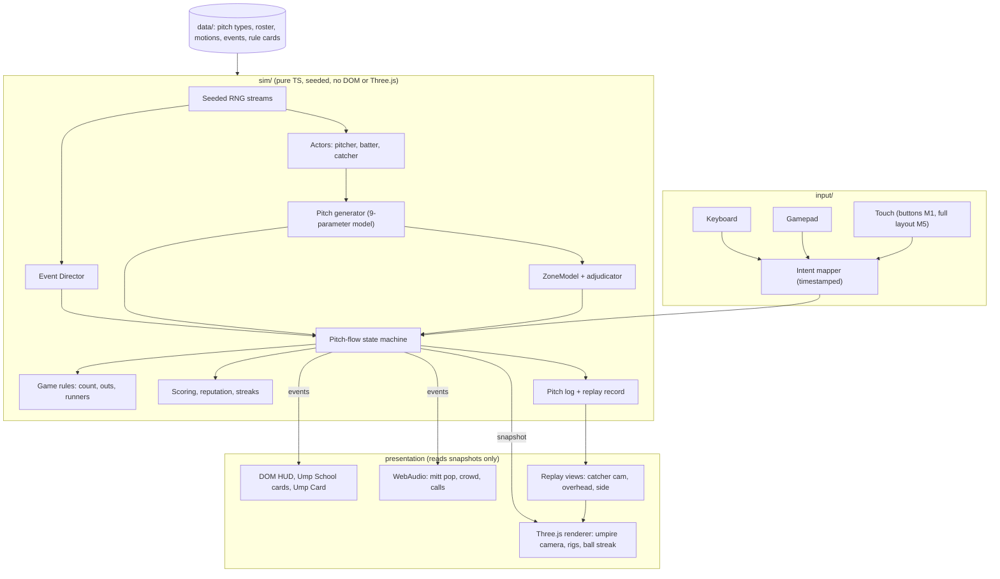
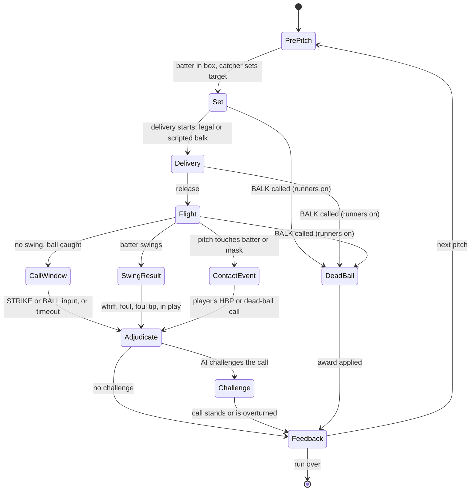
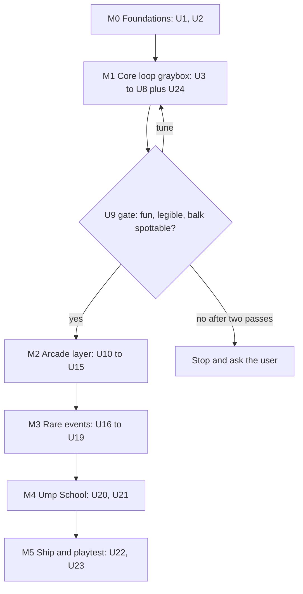

# UMP First-Person Umpire Arcade Prototype - Plan

## Goal Capsule

- **Objective:** Anyone with a desktop browser can play a short arcade run as a plate umpire, calling pitches from inside the mask, catching the occasional balk, and learning from every miss; playtests then show whether that is fun and whether players measurably improve.
- **Means:** A TypeScript and Three.js web build over a deterministic, render-free simulation core (KTD1, KTD2).
- **Authority:** User directives KD1 to KD4 outrank Requirements; Requirements outrank KTDs; KTDs outrank unit Approach text. Evidence from the M1 playtest gate (U9) may re-scope U10 onward but cannot overturn a KD without the user.
- **Execution profile:** Risk-first milestones, each ending in a playable build and one playtest question. Inside M1 the build order is U3, U5, U4, U6, U7, U8, U24, and the first deployable build comes right after U5 so pitch legibility is checked before the rest. Units through the M1 gate are specified in detail; later units state intent and exit criteria and get refined after the gate.
- **Stop conditions:** Stop and ask the user when (1) the M1 gate finds the core loop not fun after two tuning passes, (2) a KTD proves infeasible, such as the pitch staying illegible at 60 Hz after U5's streak rendering, (3) work would need licensed league or player content or a real-world training-efficacy claim, or (4) evidence contradicts a KD.
- **Who finishes:** Claude Code sessions or a human implement units in build order (Sequencing); the user owns playtests, feel and taste calls, and merges.

---

## Product Contract

### Summary

UMP is an arcade game about the one job in baseball nobody lets you play.
You crouch in the slot behind the catcher, see the pitch through your mask bars, and own the call: punch out strike three, eat foul tips, survive Robo-Ump challenges, spot the balk nobody else saw, and run the manager who crosses the line.
Every call is judged by geometry, never by mood, and every miss can be replayed in an Ump School card that shows what you should have seen and which rule applies.
The prototype is a browser build that answers three questions: is calling pitches fun, are rare events fair to spot, and do players get better.

### Problem Frame

Baseball games treat the plate umpire as scenery, yet the job is a hard, high-volume perception task.
From 2023 to 2026, MLB umpires faced about 150 called pitches a game and missed roughly 9 to 10 of them by Umpire Scorecards' grading, and since 2026 players can contest those calls in seconds. In the 2026 regular season, 10,557 ABS challenges overturned 54 percent of the calls they targeted (Appendix A).
Games that let you be the umpire are few and small. Umpire Simulator and its browser cousins are bare pitch-calling drills, uCALL for Umpires (built with MLB umpires) appears to be delisted, and The Ump Show, the closest in spirit with challenges and satire, is an itch.io demo whose Steam page says it is coming in 2026.
None of them combines a true first-person mask view, rule-accurate rare events such as balks and check-swing appeals, catcher framing as a skill, and 2026-style challenge pressure, and their users keep asking for a catcher who blocks the view and frames pitches, camera height, and miss distances (Appendix E).
The camera precedent is mixed. First Person Football was called both a blast and limiting, and ESPN Major League Baseball's First Person Baseball was panned for losing scale and the strike zone (Appendix D).
The opportunity is real but unproven, so this plan builds a prototype with a fun gate rather than a production game.

### Experience Pillars

- **The call is the game.** The zone is the playfield and every take is a decision; decisions must feel physical and consequential.
- **Blitz energy, umpire rules.** NFL Blitz cut football's tedium and amplified its spectacle. UMP cuts dead time and amplifies spectacle too, but here the rules are the game, so spectacle lives in presentation and pacing, never in adjudication.
- **Inside the mask.** Visual Concepts' First Person Football (ESPN NFL Football in 2003, back in ESPN NFL 2K5) made a familiar sport new by putting you behind the facemask. UMP's restricted view is the umpire's real constraint: the catcher's helmet, the batter's hands, a ball that crosses the plate in a blur, the foul tip that finds your mask.
- **Fair and learnable.** Truth is computed, replayable, and measured in inches. Getting good at UMP means reading pitches and applying rules better inside the game; whether that skill transfers to real umpiring would need a study.

### Key Decisions

- KD1. **First-person plate umpire; calling takes is the core loop.** User directive; challenged against a clearer broadcast camera and kept, because the restricted slot view is both the fantasy and the skill. Governs R1, R2.
- KD2. **Arcade presentation, exact adjudication.** User directive (arcade over simulation); challenged for undercutting training and kept by binding truth to geometry and making exaggerated physics a mode, not the default. Governs R5, R10, R13.
- KD3. **Training rides inside play.** User directive (training secondary); a drill-first app was rejected because fun is the primary goal. Governs R20, R21.
- KD4. **Rare events, balk identification included.** User directive; the event set beyond balks is this plan's proposal. Governs R15, R16, R17, R18, R19.
- KD5. **Default truth zone is the height-based ABS-style zone; the stance-based rulebook zone is deferred.** Proposed, awaiting approval (OQ1). Governs R2, R7.
- KD6. **Original league, teams, players, and announcer.** Proposed. Governs R24.

### Requirements

**Core calling loop**

- R1. Every pitch is seen from a first-person umpire camera in the slot behind the catcher, repositioned for the batter's handedness and framed by a visible mask.
- R2. On every pitch the batter takes, the player calls STRIKE or BALL, and the game judges the call against a computed truth zone for that batter.
- R3. Call timing is graded against the catch. A call before the glove settles is a quick call, and a call after the late threshold is a hesitant call; both cost points without changing the truth.
- R4. After any pitch the player can watch a replay showing the zone, the ball's path, the crossing point, and the miss distance in inches.
- R5. Truth comes from geometry alone; framing, crowd, streaks, difficulty, and arcade effects never alter it.

**Pitch and actor variety**

- R6. Pitches vary in type, velocity, movement, and location by pitcher archetype, with a tunable share aimed at the zone edges.
- R7. Batters vary in height, handedness, and stance, and the truth zone follows the batter.
- R8. Catchers set targets and frame pitches with skill-dependent glove movement after the catch.
- R9. Batters sometimes swing; swings resolve as whiffs, fouls, foul tips, or balls in play, and count, outs, runners, and innings advance by the rules.

**Arcade layer**

- R10. Correct calls score by count leverage, edge difficulty, and a streak multiplier that peaks in an On Fire state; misses drain a Reputation meter that ends the run at zero.
- R11. Strike three can be sold with a held or gestured input, earning a bonus when the call is correct and a larger penalty when it is wrong.
- R12. In Robo-Ump challenges the AI batter, catcher, or pitcher contests a call. An overturned call costs score and reputation, a call that survives a challenge earns a vindication bonus, and the result plays as a big-screen replay.
- R13. Every call gets immediate, exaggerated feedback through crowd, announcer line, screen effects, and first-person arm signals.
- R14. A run is a short arcade game of configurable length that ends in an Ump Card summary.

**Rare events**

- R15. A data-driven event system injects rare events at tuned rates, without long droughts or back-to-back clusters, and only in game states where the event is legal.
- R16. With runners on, the pitcher sometimes balks, and the BALK input is live from the set until the catch, with a correct call before release scoring more. A false BALK call advances runners exactly as a real umpire's call would and is penalized after R19's first warning, and a missed balk is revealed in replay.
- R17. Legal look-alike motions occur often enough that spotting a balk is a skill rather than a reflex to any unusual motion.
- R18. The prototype ships the events in the Rare Events Catalog marked for U8, U11, and U17 to U19.
- R19. Rare events ramp up within a run: none in the first inning, obvious variants before subtle ones, and a warning instead of a penalty for the first false call.

**Ump School**

- R20. Every rare event and every missed call links to an Ump School card that paraphrases the rule, cites its rule number, and replays the moment from a teaching camera.
- R21. Ump School drills isolate one skill (zone region, timing, framing, balk spotting) and report accuracy per region and per skill across sessions.
- R22. The game keeps a local, exportable pitch log for playtest analysis and sends nothing over the network.

**Platform and access**

- R23. The prototype targets current desktop Chrome and Edge at 60 fps on mid-range laptops with keyboard and gamepad through M4, adds Firefox and Safari checks in M5, and ships basic on-screen buttons for touch review from M1.
- R24. All teams, players, leagues, umpires, and announcer lines are original, and rules are paraphrased with rule-number citations, never reproduced.
- R25. Reduced-motion and reduced-flash settings exist, and every audio cue has a visual equivalent.

### Key Flows

- F1. Pitch loop
  - **Trigger:** The previous pitch resolved.
  - **Steps:** Batter digs in and catcher sets a target; pitcher comes set, and with runners on the BALK input stays live until the catch (R16); delivery and release; ball flight; catch, swing, or contact; player calls inside the call window; adjudication; optional Robo-Ump challenge; feedback and optional replay.
  - **Outcome:** Count, score, reputation, and pitch log update, and the next pitch begins.
  - **Covered by:** R1, R2, R3, R4, R5, R9, R10, R12, R13, R16
- F2. Rare event
  - **Trigger:** The Event Director selects an event that is legal for the current state.
  - **Steps:** The event plays inside F1; the player answers with the event's input; the game applies the rule's award; an Ump School card is offered.
  - **Covered by:** R15, R16, R17, R18, R19, R20
- F3. Ump School drill
  - **Trigger:** The player opens a card or picks a drill.
  - **Steps:** Concept card; teaching replay; drill reps with immediate feedback; test reps without feedback; per-skill result saved locally.
  - **Covered by:** R20, R21, R22

### Rare Events Catalog

Rule citations are to the 2026 Official Baseball Rules (Appendix A). Rows marked *later* are deferred (Scope Boundaries).

| Event | When it can occur | What the player sees | Correct response | Rule basis | Ships in |
|---|---|---|---|---|---|
| Balk, no stop in the set | Runners on | Hands come together and flow straight into the delivery | BALK | 6.02(a)(13), 5.07(a)(2) | U8 |
| Balk, flinch | Runners on, pitcher engaged | Shoulders or front knee start the delivery, then stop | BALK | 6.02(a)(1) | U17 |
| Balk, dropped ball | Runners on, pitcher touching the rubber | Ball slips out of hand or glove | BALK | 6.02(a)(11) | U17 |
| Legal look-alikes | Step-offs, head looks, and long and short sets with any runner on; the pickoff only with a runner on first; the feint to second only with a runner on second | Step-off, pickoff with a proper step toward first, feint to second, head looks, long and short sets | No call | 5.07(a)(2), 5.07(d), 6.02(a)(3) Comment, 6.02(a)(4) | U8, U17 |
| Uncaught third strike | Strike three is not caught (a swinging strike in the dirt or a dropped called third strike) | Catcher short-hops or misses strike three | When first base is open or there are two outs, point strike with no voice and the batter may run; otherwise the batter is out | 5.05(a)(2); Little League mechanic | U11 |
| Foul tip versus foul | Swings, mostly with two strikes | A tick straight into the mitt, or a foul that is not caught | FOUL TIP is a strike and the ball stays live; FOUL is dead | Definitions of Terms, FOUL TIP and STRIKE (c), (g) | U18 |
| Hit by pitch | Inside pitches | Ball strikes the batter | HBP awards first; STRIKE if he swung or the ball was in the zone; BALL if he made no attempt to avoid an out-of-zone pitch | 5.05(b)(2); Definitions of Terms, STRIKE (e), (f) | U18 |
| Foul ball off the mask | Random on fouls | Screen crack, ringing, wobble | Shake it off; no call | none | U18 |
| Ball lodged in the mask | Very rare | The pitch sticks in your mask bars | DEAD BALL; runners advance one base; batter takes first on ball four or strike three | 5.06(c)(7) and Comment | U18 |
| Check-swing appeal | Half swing that you called a ball | Catcher asks for help | Point to the first-base umpire for a right-handed batter, third-base umpire for a left-handed batter | 8.02(c) Comment; umpire-manual convention | U19 |
| Manager argument | After a high-leverage call | Manager leaves the dugout to argue the zone | WARN first; EJECT if he keeps arguing balls and strikes | 8.02(a) Comment | U19 |
| Catcher's interference | Swings | Bat ticks the catcher's mitt | INTERFERENCE; batter to first unless the manager takes the play | 5.05(b)(3) | later |
| Pitch timer and disengagement violations | Any pitch | Clock expires, batter not alert, or a third pickoff without an out | Automatic ball or strike; the third disengagement without an out is a balk | MLB pitch timer regulations | later |
| Hidden-ball trick | Runner on | Pitcher straddles the rubber without the ball | BALK | 6.02(a)(9), 6.02(a) Comment (A) | later |
| Play at the plate | Runner on third or second | Bang-bang slide and tag | SAFE or OUT, with the collision rule | 6.01(i) | later |
| Foreign-substance check | Between innings | Inspect glove and hands | EJECT on a substance | 6.02(c)(7); 6.02(d)(1) for the ejection | later |

### Acceptance Examples

- AE1. Covers R2, R5. Given a pitch whose ball edge touches the zone boundary by any amount, when the player calls STRIKE, then the call is correct.
- AE2. Covers R5, R8. Given an elite framer pulls a pitch that missed the zone into the zone after the catch, when the player calls STRIKE, then the call is incorrect and the replay shows the glove path beside the true crossing.
- AE3. Covers R9. Given two strikes, when a foul is not caught, then the count is unchanged; when a foul tip is legally caught, then it is strike three and the ball is live.
- AE4. Covers R15, R16. Given the bases are empty, then no balk event is scheduled.
- AE5. Covers R16, R17. Given a runner on first and a pickoff with a proper step toward first, when the player calls BALK, then it is a false balk call, the runner takes second, and the call is penalized after the first warning.
- AE6. Covers R18. Given a pitch touches the batter's hands while he swings, then the correct call is a strike, not a hit by pitch.
- AE7. Covers R18. Given a half swing that the player called a ball and a left-handed batter, when the catcher appeals, then the correct appeal target is the third-base umpire; given the player called the pitch a strike, then no appeal is allowed.
- AE8. Covers R3. Given a correct STRIKE input before the glove settles, then the call counts as correct and also scores a quick-call penalty.
- AE9. Covers R18. Given strike three is not caught with first base open, when the player uses the out signal, then the call is correct but the mechanic is marked wrong, and the batter may still run.

### Success Criteria

- SC1. **Fun.** In moderated playtests with at least eight players of mixed baseball knowledge, the median rating of *I want to keep calling pitches* is at least 4 of 5 after a ten-minute run, and at least half start a second run unprompted.
- SC2. **Learning.** Learning is measured with fixed before and after test blocks of fresh seeds from the same distribution, played without feedback. The report gives each player's change in shadow-region accuracy, and the median change is a gain.
- SC3. **Rare-event fairness.** After one Ump School balk drill, balk detection beats the player's first exposures at matched subtlety, with at least 10 trials per block, while false balk calls stay at or below one per run.
- SC4. **Trust.** Shown the replay of a disputed call, playtesters accept the truth; any report that a replay contradicts what was on screen is treated as a bug.
- SC5. **Technical.** The game holds 60 fps on a mid-range integrated-GPU laptop in Chrome, and call input reaches on-screen feedback within 100 ms, excluding deliberate animation.
- SC6. **Expert check.** A certified umpire reviews the Ump School cards before any public share.

### Scope Boundaries

**Deferred for later**

- Stance-based rulebook zone as an Ump School option (KD5).
- WebXR mode where the player's real arm throws the punch-out; Three.js keeps this reachable from the same codebase.
- Daily Zone, one seeded set of pitches per day with a shareable text result, which needs no server because the sim is deterministic.
- Catalog rows marked *later*.
- Career mode, online leaderboards, recorded voice-over, and a mobile-first layout.

**Outside this product's identity**

- Controlling the batter, pitcher, or fielders, and full fielding simulation.
- Licensed league, team, player, or umpire content.
- Any claim that UMP certifies umpires or trains them to a standard.

### Outstanding Questions

None of these block M0 or M1, and OQ1 gates U10; each has a recommended default that the plan already uses.

- OQ1. Truth zone default (KD5). The recommended default is the ABS-style height zone, because it matches how 2026 MLB challenges are decided and is unambiguous to compute and show. The alternative is the rulebook stance zone, which is what amateur umpires call and so transfers better to real games; if training counts, the rulebook zone should become the Ump School default. Umpires historically called the bottom of the zone near 24.2 percent of batter height versus ABS's 27 percent, about two inches on a six-foot batter (MLB.com's ABS explainer). The `ZoneModel` seam (KTD4) makes either a small change.
- OQ2. Platform priority. The recommended order is desktop web first, mobile web in M5, and WebXR after the prototype. The alternatives are mobile-first or VR-first.
- OQ3. Art direction. The recommended look is stylized low-poly with exaggerated proportions, readable silhouettes, and saturated color, which suits Blitz energy and procedural rigs. The alternatives are a retro PS2-era look or realism.
- OQ4. Working title. UMP (the repository name) for now; alternatives include *Hey Blue!* and *Ring 'Em Up*.
- OQ5. Who plays at the M1 gate, and is a certified umpire available for SC6?

### Sources

Appendix H lists every source; rule text is in Appendix A and IP notes are in Appendix G.

---

## Planning Contract

### Key Technical Decisions

- KTD1. **TypeScript, Three.js, and Vite, shipped as a static web build.** An all-code stack is what an agent-driven workflow iterates on fastest, a static build deploys to GitHub Pages with no server, Playwright verifies it headlessly in this container, and Three.js keeps a WebXR mode reachable. Measured here, a minimal lit scene bundles to 134 KB gzipped with Three.js r186 versus 431 KB for Babylon.js 9.29, 516 KB for PlayCanvas 2.23, and a 10.1 MB gzipped engine binary for a Godot 4.7.2 single-threaded web export (Appendix F). Godot is the strongest alternative for an editor-driven team; it was rejected for this prototype because its editor-centric workflow and heavier runtime slow an agent-driven loop. Babylon.js is the fallback if Three.js lacks something material.
- KTD2. **A deterministic simulation core with no DOM or Three.js imports.** `src/sim/` owns rules, pitches, actors, events, and scoring and advances on an explicit clock with seeded, per-subsystem random streams. The renderer reads snapshots and never mutates sim state. This buys unit tests, exact replays, golden-log regression tests, seeded drills, and a cheap Daily Zone later. An ESLint `no-restricted-imports` rule and a DOM-free tsconfig for `src/sim/` enforce the boundary, and the sim lint rules also ban `Math.random`, `Date`, and `performance` inside `src/sim/` and `src/data/`. Sim code avoids engine-dependent transcendental functions in logged paths (the normal noise uses an Irwin-Hall sum of uniforms), logged values are rounded to fixed decimals, and golden tests run in Firefox and WebKit before the Daily Zone ships.
- KTD3. **The constant-acceleration nine-parameter pitch model with closed-form plate crossings.** PITCHf/x fit every pitch with this model (initial position, velocity, and constant acceleration on three axes), so public pitch data maps onto it directly. The generator solves the initial velocity that sends a pitch of a given type, release, and movement to a target crossing, then adds command noise. Crossings are solved in closed form because frame sampling skips the plate at game speeds (see Pitch and Perception Model).
- KTD4. **A pluggable `ZoneModel`, with the ABS-style height zone implemented first.** Implements KD5. The interface returns the truth, the signed distance from the ball's edge to the nearest zone edge, and the crossing point; the rulebook stance zone can be added later behind the same interface.
- KTD5. **Procedural rigs driven by data-defined motion scripts.** Pitcher deliveries, legal look-alikes, and balk variants are keyframe data, and a balk is a small delta on a legal script, so anomalies are parametric, testable, and cheap to add. The sim owns the release point, and the rig's throwing arm solves a two-bone IK to meet it at the release key, so the ball always leaves the hand and the renderer never feeds the sim. Motion-capture clips can be time-warped or layered too. Procedural keyframes were chosen because they need no asset pipeline and keep anomalies data-driven, and a motion-capture base with scripted changes is the fallback if rigs read stiff.
- KTD6. **Semantic input intents stamped with event time.** Keyboard, gamepad, and touch adapters emit intents such as `CALL_STRIKE`, `CALL_BALL`, `CALL_BALK`, and `SELL`, each stamped with `event.timeStamp` mapped into sim time, so timing grades do not depend on frame rate. Gamepads have no input events, so their intents carry the poll time and get a slightly wider window. Input availability depends only on the legal game state (BALK whenever runners are on, per R16), never on whether an event is happening, so an available input never gives an event away. Calls that can occur at the same moment get separate inputs, so `Space` stays BALK and later events get their own bindings.
- KTD7. **A data-driven Event Director.** Each event definition declares preconditions, base weight, cooldown, and a pity threshold; the director is a pure sim component that debug triggers can drive and Monte Carlo tests can check.
- KTD8. **Leverage-weighted scoring.** Points equal a base value times a count-leverage weight times an edge-difficulty factor times the streak multiplier, where the edge factor peaks within an inch of the zone edge and tapers to baseline by about four inches; penalties scale with leverage and with how obvious the miss was. Count weights derive from published run values (Appendix C).
- KTD9. **DOM overlay for HUD, menus, cards, and the Ump Card.** Text-heavy UI is faster to build, readable by screen readers, and easy to assert in Playwright; the canvas renders only the world.
- KTD10. **The ball renders as a motion streak swept between sub-frame positions.** Each frame draws the ball's path since the previous frame, and the frame that spans the plate passes the streak through the true crossing, so what the player saw always agrees with the replay.
- KTD11. **WebAudio with synthesized placeholder sounds; the announcer is on-screen text with optional `speechSynthesis`.** Mitt pop, crowd beds, and umpire calls are placeholders good enough to judge feel; recorded voice is deferred. Audio unlocks on the first input to satisfy autoplay rules.
- KTD12. **Content lives in typed TypeScript data modules.** Pitch types, roster, motions, events, rule cards, and announcer lines use `as const satisfies` types, so content mistakes fail the typecheck without a runtime schema library.
- KTD13. **The Makefile is the single entry point.** `make help` lists targets that wrap npm scripts, CI runs the same targets, and GitHub Pages deploys each default-branch build. Ump School cards stay behind a build flag until SC6 passes, and M1 feedback text is limited to one-line paraphrases with rule numbers.
- KTD14. **Telemetry stays local.** The pitch log lives in IndexedDB and exports as JSON or CSV from a debug menu (R22).
- KTD15. **WebGLRenderer, not WebGPURenderer, for the prototype.** In this container's headless Chromium 141, Three.js r186 `WebGLRenderer` rendered correctly while `WebGPURenderer` failed on its WebGPU backend and only worked when forced onto WebGL (Appendix F). The prototype needs nothing WebGPU-specific.

### High-Level Technical Design

Module topology. The sim is pure and deterministic; presentation reads snapshots and events.

Per-pitch state machine (F1 and F2).

Milestones and gates. Every milestone ends playable; the M1 gate can re-scope everything after it.

### Pitch and Perception Model

**Frame and dimensions.** Use the PITCHf/x convention: origin at the back point of home plate on the ground, +x toward the catcher's right, +y toward the pitcher, +z up, in feet. PITCHf/x reports plate location at the front edge of the plate, y = 17/12 ft. Official dimensions from the 2026 rules: the plate is a 17-inch square with two corners removed (front edge 17 in, sides 8.5 in, rear edges 12 in); the front of the rubber is 60 ft 6 in from the back point of the plate; the rubber is 10 in above the plate; the ball is 9 to 9.25 in around, so 2.86 to 2.94 in across.

**Slot.** Umpire coaching puts the nose on or just inside the inside corner and the chin no lower than the top of the catcher's helmet, with the head still and the eyes doing the tracking (Appendix C). That sets the camera's starting offset and height; the tuning panel exposes both.

**Release.** A typical MLB pitcher releases the ball about 6.4 ft in front of the rubber, so release sits near y = 54 ft. Release height and side are archetype parameters that start near 6 ft high and 1.5 to 2.5 ft to the arm side and get tuned in U10.

**What the player can actually see.** The table is computed for a 94.8 mph four-seamer (the 2026 leaderboard average), an assumed 8 percent speed loss, and an assumed slot eye 1.0 ft to the batter's side, 3.75 ft behind the plate's back point, and 3.5 ft high.

| Ball position (ft from plate's back point) | Distance to eye (ft) | Angular speed (deg/s) | Jump per 60 Hz frame (deg) | Ball's angular size (deg) |
|---|---|---|---|---|
| 40 | 43.8 | 5 | 0.1 | 0.32 |
| 20 | 23.8 | 18 | 0.3 | 0.58 |
| 10 | 13.8 | 54 | 0.9 | 1.00 |
| 5 | 8.9 | 132 | 2.2 | 1.56 |
| 1.42 (front of plate) | 5.4 | 361 | 6.0 | 2.58 |
| 0 (back point) | 4.0 | 645 | 10.8 | 3.45 |

Flight from release to the front of the plate takes about 395 ms, and the ball covers about 2.1 ft per 60 Hz frame near the plate (1.1 ft at 120 Hz). Three consequences shape the design.

- Frame sampling cannot locate the crossing; it is solved in closed form (KTD3) and drawn as a streak through the crossing (KTD10).
- Over the plate the ball jumps two to three of its own widths per 60 Hz frame. Smooth pursuit reaches up to about 100 degrees per second (Meyer, Lasker, and Robinson 1985, cited in SABR's review), and Bahill and LaRitz's major leaguer reached about 120. From the slot this ball passes 100 degrees per second about 4.9 ft before the front of the plate and 120 about 4.0 ft before it, so nobody follows it continuously across the zone. The difficulty is analogous to the real job. The player, like a real umpire, must read the path before the plate and the catch after it.
- An effective strike zone is 19.9 in wide once the ball's radius counts on both edges, which the ABS-style zone (KTD4) applies on every edge.

### Assumptions

- A1. Players have a keyboard or a standard-mapping gamepad and a display of 60 Hz or faster.
- A2. The ABS-style zone is an acceptable truth for an arcade game even though amateur umpires call the rulebook zone (OQ1).
- A3. Placeholder art plus the U24 slice is enough to judge fun at the M1 gate.
- A4. Real-world values in Appendices B and C are starting points tuned by playtest, not targets to match.
- A5. Speed loss from release to plate is about 8 percent; U3 makes it a per-type parameter.

### Sequencing

| Milestone | Units | Exit criterion |
|---|---|---|
| M0 Foundations | U1, U2 | `make check` and `make e2e` pass in CI; a placeholder scene is live on GitHub Pages |
| M1 Core loop graybox | U3 to U8 plus U24 | 50 seeded pitches can be called with feedback, replay, and U24's score, sounds, arms, and challenge; the no-stop balk can be spotted |
| Gate | U9 | Go, tune, or stop decision recorded against U9's pass bars from at least five different players |
| M2 Arcade layer | U10 to U15 | A full arcade run with scoring, reputation, challenges, juice, and an Ump Card |
| M3 Rare events | U16 to U19 | Every catalog row marked for U11 and U17 to U19 plays at its tuned rate with the correct award |
| M4 Ump School | U20, U21 | Cards for every event and miss type; drills with saved per-skill progress |
| M5 Ship | U22, U23 | Public build with settings and touch; SC1 to SC6 evaluated |

Inside M1, units are built in the order U3, U5, U4, U6, U7, U8, U24. The first deployable build comes right after U5, so pitch legibility is checked before the rest of M1 is built.

### Risks and Mitigations

| Risk | Mitigation | Owner |
|---|---|---|
| The pitch is illegible at 60 Hz | Sub-frame streak (KTD10), FOV and slot tuning, the first deployable build right after U5 (Sequencing), and a slow-motion assist as an easiest-difficulty option added only after U5 proves legibility without assists | U5 |
| Calling feels like a chore after a few minutes | U24's thin arcade slice before the gate, then leverage stakes, a rare event every several pitches, short runs, challenges, and the sell | U24, U9 gate, U12 to U15 |
| Players blame the game for misses | Replays in inches, a camera that holds still from the set to the catch (U5), a streak through the true crossing (SC4) | U5, U7, U13 |
| Watching the pitcher's set and then the ball overloads novices | The BALK input stays live from the set to the catch (R16); a balk drill early in Ump School | U8, U17, U20 |
| Procedural rigs read stiff or ambiguous | Exaggerated key poses, strong silhouettes, slow-motion tuning sessions, and a motion-capture base with scripted changes as the fallback (KTD5) | U8, U17 |
| A realistic FOV makes the pitcher tiny | FOV and slot offsets live in the tuning panel; test both extremes | U5 |
| Browser variance (Safari audio unlock, gamepad mapping) | Unlock audio on first input, use the standard gamepad mapping, keep a cross-browser smoke list | U6, U22 |
| IP exposure | Original names, voices, and marks; paraphrased rules (R24) | All |
| Overclaiming training value | Measure in-game learning only (SC2, SC3); expert review (SC6) | U21, U23 |
| Scope creep | Units after U9 stay intent-level until the gate re-scopes them | U9 |

### Tooling and Workflow

- `make` targets (KTD13): `help`, `dev`, `test`, `golden`, `e2e`, `build`, `preview`, `lint`, `typecheck`, `check`.
- Current package versions on npm at planning time: `three` 0.186.1, `vite` 8.3.2, `vitest` 5.0.3, `@playwright/test` 1.63.0, `typescript` 7.0.2, `fast-check` 4.10.2, `lil-gui` 0.21.0, `eslint` 10.12.0. TypeScript is pinned to 6.0.3 because `typescript-eslint` 8.71 supports TypeScript below 6.1, and `@playwright/test` is pinned to 1.56.1 because it matches the container's Chromium build 1194, which CI also installs.
- Local Playwright runs reuse the container's Chromium under `/opt/pw-browsers`; CI installs Playwright's managed Chromium.
- Optional agent skills for implementation sessions, found through the skills registry: `anthropics/skills@webapp-testing` (official, Playwright-based app testing) and the `cloudai-x/threejs-skills` set (community, about 11,000 to 16,000 installs each, mostly Three.js API reference). Neither is required.

---

## Implementation Units

| U-ID | Title | Key files | Depends on |
|---|---|---|---|
| U1 | Project scaffold, tooling, and CI | `package.json`, `Makefile`, `.github/workflows/` | none |
| U2 | Deterministic sim kernel | `src/sim/rng.ts`, `src/sim/field.ts` | U1 |
| U3 | Pitch trajectory and generator | `src/sim/pitch/`, `src/data/pitchTypes.ts` | U2 |
| U4 | Zone model and adjudication | `src/sim/zone/` | U3 |
| U5 | Graybox ballpark and umpire camera | `src/render/` | U1, U3 |
| U6 | Input intents and call timing | `src/input/`, `src/sim/call/timing.ts` | U2 |
| U7 | Pitch flow, game state, feedback, and replay | `src/sim/game/`, `src/ui/`, `src/render/replay/` | U4, U5, U6 |
| U8 | Motion scripts, runners, and the first balk | `src/render/actors/`, `src/data/motions.ts` | U7 |
| U24 | Thin arcade slice for the M1 gate | `src/sim/scoring/arcade.ts`, `src/sim/challenge.ts`, `src/render/actors/umpireArms.ts` | U8 |
| U9 | Playtest kit and M1 gate | `scripts/analyze-log.ts`, `docs/playtests/` | U24 |
| U10 | Roster with framing catchers | `src/sim/actors/`, `src/data/roster.ts` | U9 |
| U11 | Swings, contact, and abstract outcomes | `src/sim/game/outcomes.ts` | U10 |
| U12 | Scoring, reputation, streaks, and the sell | `src/sim/scoring/` | U11 |
| U13 | Robo-Ump challenges and big-screen replay | `src/sim/challenge.ts` | U12 |
| U14 | Feedback juice | `src/audio/`, `src/render/actors/umpireArms.ts` | U12 |
| U15 | Arcade run structure and Ump Card | `src/modes/arcade.ts`, `src/ui/umpCard.ts` | U13, U14 |
| U16 | Event Director and catalog | `src/sim/events/` | U15 |
| U17 | Balk family and legal look-alikes | `src/data/motions.ts`, `src/sim/events/balk.ts` | U16 |
| U18 | Contact events | `src/sim/events/contact.ts` | U16 |
| U19 | Check-swing appeal and manager argument | `src/sim/events/appeal.ts`, `src/sim/events/argument.ts` | U16 |
| U20 | Ump School cards and teaching replays | `src/modes/umpSchool.ts`, `src/data/ruleCards.ts` | U17, U18, U19 |
| U21 | Drills, adaptive targeting, and progress | `src/modes/drills.ts` | U20 |
| U22 | Settings, accessibility, touch, and performance | `src/ui/settings.ts`, `src/input/touch.ts` | U21 |
| U23 | Public prototype build and external playtest | `docs/playtests/` | U22 |

### U1. Project scaffold, tooling, and CI

- **Goal:** `make check`, `make e2e`, and `make build` pass locally and in CI, and a placeholder Three.js scene deploys to GitHub Pages.
- **Requirements:** R23; enables every other unit.
- **Dependencies:** None.
- **Files:** `package.json`, `package-lock.json`, `tsconfig.json`, `tsconfig.sim.json`, `vite.config.ts`, `index.html`, `src/main.ts`, `Makefile`, `eslint.config.js`, `.prettierrc`, `vitest.config.ts`, `playwright.config.ts`, `tests/e2e/boot.spec.ts`, `.github/workflows/ci.yml`, `.github/workflows/pages.yml`, `.gitignore`, `README.md`, `CLAUDE.md`.
- **Approach:** Start from Vite's `vanilla-ts` template with TypeScript `strict` and `noUncheckedIndexedAccess`. Vitest runs unit and property tests; Playwright runs e2e with the flags in Appendix F. `make help` self-documents every target. Rewrite `README.md` as the project README (the planning note it holds today stays in git history) and add `CLAUDE.md` with the sim-purity rule, the make targets, and test conventions for future agent sessions. The Pages workflow publishes `dist/` from the default branch with Vite's `base` set to the repository path.
- **Test scenarios:** The boot spec waits for rendered frames, asserts a canvas exists, checks that a sampled pixel differs from the clear color, and saves a screenshot artifact.
- **Verification:** `make check && make e2e && make build` locally and in CI.

### U2. Deterministic sim kernel

- **Goal:** A render-free sim layer with seeded randomness, explicit time, typed events, and real field geometry that every later unit builds on.
- **Requirements:** R5, R22.
- **Dependencies:** U1.
- **Files:** `src/sim/rng.ts`, `src/sim/units.ts`, `src/sim/field.ts`, `src/sim/clock.ts`, `src/sim/events.ts`, `src/sim/index.ts`, `tests/sim/rng.test.ts`, `tests/sim/field.test.ts`.
- **Approach:** Implements KTD2. A small, fast PRNG (sfc32 or similar) exposes `fork(label)` so each subsystem draws from its own named stream; adding a draw in one system then never shifts another's sequence, which keeps golden logs stable. `units.ts` provides explicit feet, inches, and mph helpers. `field.ts` encodes the plate pentagon, rubber distance, mound height, and the coordinate frame from the Pitch and Perception Model.
- **Test scenarios:** The same seed yields the same sequence; forked streams are independent; extra draws on one stream leave the others unchanged; plate vertices match the official dimensions; unit conversions round-trip.
- **Verification:** `make test`; the lint rules reject a deliberate `three` import and a `Math.random` call in fixtures under `src/sim/`.

### U3. Pitch trajectory and generator

- **Goal:** Pitches move like real pitch types and cross where the pitcher aimed, plus a controllable miss.
- **Requirements:** R6.
- **Dependencies:** U2.
- **Files:** `src/sim/pitch/trajectory.ts`, `src/sim/pitch/generator.ts`, `src/sim/pitch/types.ts`, `src/data/pitchTypes.ts`, `tests/sim/pitch.test.ts`.
- **Approach:** Implements KTD3. `trajectory.ts` exposes `positionAt(t)`, `velocityAt(t)`, and `timeAtY(y)` in closed form. The generator takes a pitch type, release point, velocity, induced movement, and target crossing; converts movement to constant accelerations over the flight; solves the initial velocity; then applies command noise in inches. An arcade multiplier scales movement for the exaggerated mode. Starting values come from Appendix B.
- **Test scenarios:** Zero-noise pitches cross within 0.1 in of target; the closed-form crossing matches a 0.1 ms numeric integration within 0.05 in; release-to-plate speed loss stays inside its configured band; each type's velocity and movement stay inside the configured spread around the Appendix B means in `src/data/pitchTypes.ts` over 10,000 seeded draws.
- **Verification:** `make test`.

### U4. Zone model and adjudication

- **Goal:** An exact, explainable truth for every pitch, including how far it missed.
- **Requirements:** R2, R4, R5, R7.
- **Dependencies:** U3.
- **Files:** `src/sim/zone/model.ts`, `src/sim/zone/absZone.ts`, `src/sim/zone/adjudicate.ts`, `src/sim/zone/regions.ts`, `tests/sim/zone.test.ts`.
- **Approach:** Implements KTD4 and KD5. `ZoneModel.evaluate(trajectory, batter)` returns `isStrike`, a signed `edgeDistanceIn` (negative inside), and the crossing. The ABS-style model uses the plane, height percentages, and ball-touch rule in Appendix A. `regions.ts` classifies heart, shadow, chase, and waste using the bands in Appendix C; regions drive scoring difficulty and drill reports, never truth.
- **Test scenarios:** Property tests with fast-check: pitches inside the ball-inflated zone are strikes and pitches outside are balls; the sign of `edgeDistanceIn` always agrees with `isStrike`; results mirror between left- and right-handed batters; a ball tangent to an edge is a strike; zone height scales with batter height.
- **Verification:** `make test`.

### U5. Graybox ballpark and umpire camera

- **Goal:** The view feels like crouching behind the plate, and a 95 mph pitch stays legible at 60 Hz.
- **Requirements:** R1, R5, R23.
- **Dependencies:** U1, U3.
- **Files:** `src/render/renderer.ts`, `src/render/scene/ballpark.ts`, `src/render/actors/placeholders.ts`, `src/render/camera/umpireCamera.ts`, `src/render/overlay/mask.ts`, `src/render/fx/ballStreak.ts`, `src/debug/panel.ts`, `src/debug/overlays.ts`, `tests/render/ballStreak.test.ts`, `tests/e2e/camera.spec.ts`.
- **Approach:** A real-scale graybox: plate, batter's boxes, mound, dirt, backstop, outfield wall, and a crowd of instanced billboards. Placeholder batter and catcher figures in `src/render/actors/placeholders.ts` stand at true scale, and the catcher's helmet partly blocks the low part of the view, as it does for a real plate umpire. Batters are drawn so their stance landmarks (the hollow of the knee and the midpoint between shoulders and belt) sit at the ABS edges by construction, and stance variety stays cosmetic within a narrow range until OQ1 is settled, which happens before U10. The camera sits in the slot on the batter's side; slot offset, eye height, FOV, and idle sway are tuning-panel parameters seeded from the Pitch and Perception Model. The camera holds still from the set to the catch and sways only between pitches. The mask is a camera-attached bar mesh with a soft vignette. KTD10's streak renders the ball. Debug overlays toggle the true zone, the crossing marker, and the catch point. The tuning panel uses lil-gui behind a backtick toggle.
- **Execution note:** Prove legibility before polish. If the streak alone does not make the crossing readable in a headed 60 Hz run, raise it as a stop condition instead of layering assists.
- **Test scenarios:** With a fixed seed and the sim paused, screenshots at the set, mid-flight, and crossing frames are non-blank and show the overlay when enabled. A unit test checks that the streak segment in the crossing frame passes within the ball radius of the true crossing. In e2e, the streak's pixels in a frozen crossing frame cover the projected crossing point, and the camera transform does not change from the set to the catch.
- **Verification:** `make e2e`; a manual headed check at 60 Hz and at the display's native rate.

### U6. Input intents and call timing

- **Goal:** Calls feel instant and are graded by when they happened, not by frame rate.
- **Requirements:** R2, R3, R23.
- **Dependencies:** U2.
- **Files:** `src/input/intents.ts`, `src/input/keyboard.ts`, `src/input/gamepad.ts`, `src/input/touch.ts`, `src/sim/call/timing.ts`, `src/data/tuning.ts`, `tests/sim/timing.test.ts`, `tests/e2e/input.spec.ts`.
- **Approach:** Implements KTD6. Default bindings put STRIKE on `J` or the right trigger, echoing the umpire's right-arm strike signal, BALL on `F` or the left trigger, and BALK on `Space` or the bottom face button. On touch devices, on-screen STRIKE, BALL, and BALK buttons ship in M1 so the prototype can be reviewed on a phone; the full touch layout stays in U22. `timing.ts` grades a call as quick, clean, or hesitant against the catch event, with windows in `src/data/tuning.ts`. The clean window opens after a tunable settle delay of about 0.3 to 0.5 seconds after the catch, so framing has a chance to fool the player. Umpire coaching says to wait about 0.75 to 1.15 seconds after the ball hits the glove before calling (Appendix C), so a call inside that coached window earns a pro-timing tag, and the U21 timing drill grades against the coached window. A call timeout counts as a missed call.
- **Test scenarios:** Grades flip exactly at window edges; an input stamped between two frames is graded by its timestamp; a call inside the coached window carries the pro-timing tag; a timeout counts as a missed call; in e2e, a scripted key press after the settle delay yields a clean grade, and a tap on the on-screen BALL button in an emulated phone viewport emits `CALL_BALL`.
- **Verification:** `make test && make e2e`.

### U7. Pitch flow, game state, feedback, and replay

- **Goal:** The single-pitch loop runs end to end with honest feedback and a replay of any pitch.
- **Requirements:** R2, R3, R4, R5, R22.
- **Dependencies:** U4, U5, U6.
- **Files:** `src/sim/game/state.ts`, `src/sim/game/rules.ts`, `src/sim/game/pitchFlow.ts`, `src/sim/log/pitchLog.ts`, `src/ui/hud.ts`, `src/ui/feedback.ts`, `src/render/replay/replayView.ts`, `tests/sim/rules.test.ts`, `tests/sim/golden.test.ts`, `tests/golden/`.
- **Approach:** The state machine follows the per-pitch diagram; in M1 batters only take, and swings arrive in U11. Rules cover the count, walks, strikeouts, outs, and half-innings. The HUD shows count, outs, and the U24 score. Feedback names the truth, the timing grade, and the miss in inches, and keeps rule text within KTD13's one-line limit. Replays render from the catcher view and overhead with the zone, path, and crossing at adjustable speed. The pitch log records seed, parameters, crossing, truth, call, timing, region, and count for every pitch and exports JSON. It also records frame-time stats and input-to-feedback latency per pitch, which the golden comparison skips, and `scripts/analyze-log.ts` (U9) reports their 95th percentile against SC5.
- **Test scenarios:** Ball four walks the batter; strike three records an out; three outs end the half-inning; a seeded 30-pitch input script reproduces a byte-identical log apart from the frame-time and latency fields.
- **Verification:** `make check && make e2e`.

### U8. Motion scripts, runners, and the first balk

- **Goal:** Pitchers deliver with readable bodies, and a common balk, no stop in the set, can be spotted and called.
- **Requirements:** R16, R17.
- **Dependencies:** U7.
- **Files:** `src/render/actors/rig.ts`, `src/render/actors/motionPlayer.ts`, `src/sim/actors/pitcherMotion.ts`, `src/data/motions.ts`, `src/sim/game/runners.ts`, `src/sim/events/balk.ts`, `src/debug/spotTheBalk.ts`, `tests/sim/balk.test.ts`, `tests/render/rig.test.ts`.
- **Approach:** Implements KTD5. A primitive humanoid rig (capsule limbs, box torso, sphere head) plays keyframe scripts through stretch, come set, stop, leg lift, stride, arm cock, release, and follow-through. The rule requires a complete stop of no set length (Appendix A), so UMP operationalizes a complete stop as the hands being still for a visible beat, a tunable stillness threshold that cards must label as the game's interpretation rather than the rule's text. Set length varies per pitcher and per pitch, which is the first legal look-alike. The balk variant removes the stop. Scenarios can place a runner at first. BALK is its own intent (KTD6) and is live as R16 describes; any BALK call kills the play and applies the award in Appendix A. A blind, full-speed spot-the-balk test page plays 20 or more random legal and no-stop deliveries from the default camera and counts correct spots and false alarms.
- **Test scenarios:** Every legal script holds the hands still for at least the stillness threshold; the no-stop variant never does; a BALK between the set and the catch of a balk script is correct and scores more before release than after; a BALK on a legal script is a false call that still advances the runners, draws a warning the first time, and is penalized after that; the award moves each runner exactly one base; with the bases empty no balk is scheduled and the BALK input is not live; the drawn hand at the release key sits within tolerance of the sim release point.
- **Verification:** `make test && make e2e`; a manual slow-motion comparison of legal and balk deliveries, and a blind full-speed run of the spot-the-balk page.

### U24. Thin arcade slice for the M1 gate

- **Goal:** The M1 gate judges fun with stakes, sound, arms, and a challenge in place, not a bare pitch-calling drill.
- **Requirements:** R10, R12, R13 (partial, completed in U12 to U14).
- **Dependencies:** U8.
- **Files:** `src/sim/scoring/arcade.ts`, `src/sim/challenge.ts`, `src/audio/engine.ts`, `src/render/actors/umpireArms.ts`, `src/ui/hud.ts`.
- **Approach:** A correct call scores a base value times KTD8's count weight for the count it was made in, and a streak counter tracks consecutive correct calls; the HUD shows both. U12 adds the edge factor, the streak multiplier, and reputation. Synthesized placeholder sounds (KTD11) give a mitt pop, a crowd swell, and a short call voice. First-person arms play the called-strike hammer and a strike-three punch-out. Each half-inning gives the AI one Robo-Ump challenge opportunity, taken when a call against it missed by more than a tunable distance or, at a tunable rate, on a close correct call; U13 replaces this rule with the breakeven model. The challenge ends in a CALL STANDS or OVERTURNED card, and a call that stands earns R12's vindication bonus. A tunable seconds-per-pitch pace target sets the gap between pitches and is recorded in the pitch log.
- **Test scenarios:** A correct call at 3-2 scores 7.6 times the same call at 0-0; a miss resets the streak counter; the AI gets at most one challenge opportunity per half-inning; a challenged correct call ends CALL STANDS and adds the vindication bonus; a challenged wrong call ends OVERTURNED and costs score; every U24 sound has a visual cue (R25); every pitch log entry carries the pace target; in e2e, a scripted correct STRIKE call raises the HUD score and plays the hammer.
- **Verification:** `make check && make e2e`; a manual feel review.

### U9. Playtest kit and M1 gate

- **Goal:** Decide go, tune, or stop on evidence before building the arcade layer.
- **Requirements:** R22; informs SC1 to SC5.
- **Dependencies:** U24.
- **Files:** `src/ui/survey.ts`, `scripts/analyze-log.ts`, `docs/playtests/m1-findings.md`.
- **Approach:** A three-question post-run survey stored with the local log. `scripts/analyze-log.ts` summarizes accuracy by region, timing grades, balk detection, false balk calls, and U7's frame-time and latency percentiles across exported logs. The user runs moderated sessions with at least five different players, at least two of whom rarely watch baseball, and records findings; the plan's U10 onward is then updated from them.
- **Gate questions:** Is calling fun for ten minutes with placeholder art and the U24 slice? Can players read the pitch, especially at the edges? Is the balk spottable without being trivial?
- **Pass bars:** These example thresholds are starting bars the user can change, and `scripts/analyze-log.ts` reports each one. Fun needs a median rating of at least 3.5 of 5, with at least 3 of 5 players asking for another run. Legibility needs at least 95 percent accuracy on heart and waste pitches, with shadow-region accuracy rising across runs. Balk spotting needs at least 60 percent detection of the obvious balk, with at most one false BALK call per run.
- **Verification:** The findings doc is committed, and the plan is re-scoped or explicitly left unchanged.

### U10. Roster with framing catchers

- **Goal:** Variety and difficulty come from who is pitching, hitting, and catching.
- **Requirements:** R6, R7, R8.
- **Dependencies:** U9, and OQ1 settled.
- **Files:** `src/sim/actors/pitcher.ts`, `src/sim/actors/batter.ts`, `src/sim/actors/catcher.ts`, `src/data/roster.ts`.
- **Approach:** Pitcher archetypes carry mix, velocity, movement, command, and edge preference (a flamethrower, a painter, a knuckleballer, a wild thing). Batters carry height, handedness, and stance, drawn to U5's landmark rule. Catchers carry framing skill and target setup; post-catch glove drift is presentation only (R5).
- **Test scenarios:** The zone follows batter height; framing never changes truth; archetype distributions match their definitions over seeded draws.
- **Verification:** `make check`.

### U11. Swings, contact, and abstract outcomes

- **Goal:** Batters swing like batters, and the game moves without simulating fielders.
- **Requirements:** R9, R18.
- **Dependencies:** U10.
- **Files:** `src/sim/actors/batter.ts`, `src/sim/game/rules.ts`, `src/sim/game/outcomes.ts`.
- **Approach:** Swing probability depends on location, count, and aggressiveness and is scaled down in arcade mode so the player gets more takes. Contact resolves to whiff, foul, foul tip, or ball in play; balls in play resolve by weighted roll with a short camera turn and an announcer line. The uncaught third strike follows its catalog row.
- **Test scenarios:** A foul with two strikes leaves the count unchanged; a caught foul tip with two strikes is a strikeout; an uncaught third strike lets the batter run only when first is open or there are two outs; runners advance correctly on abstract hits.
- **Verification:** `make check`.

### U12. Scoring, reputation, streaks, and the sell

- **Goal:** The arcade layer turns calls into stakes.
- **Requirements:** R10, R11.
- **Dependencies:** U11.
- **Files:** `src/sim/scoring/arcade.ts`, `src/sim/scoring/leverage.ts`, `src/data/leverage.ts`, `src/ui/meters.ts`.
- **Approach:** Implements KTD8 with Appendix C weights, extending U24's score and streak counter. Three straight correct shadow-region calls put the umpire On Fire, borrowing NBA Jam's and NFL Blitz 2000's consecutive-success trigger (Appendix D). On Fire brings a higher multiplier and a ball trail through the zone until the next miss or overturned challenge, and the trail aids reading, never truth (R5). The sell is a hold-and-release meter on strike three with named punch-out styles bound to input patterns; style changes score, never truth.
- **Test scenarios:** The same correct call scores more at 3-2 than at 0-0; an edge call scores more than a heart call; a wrong sold call costs more than a wrong plain call; reputation at zero ends the run.
- **Verification:** `make check`; a manual feel review.

### U13. Robo-Ump challenges and big-screen replay

- **Goal:** The challenge moment becomes built-in drama and built-in feedback.
- **Requirements:** R4, R12.
- **Dependencies:** U12.
- **Files:** `src/sim/challenge.ts`, `src/render/replay/bigScreen.ts`, `src/data/challengeRules.ts`.
- **Approach:** Extends U24's single challenge opportunity per half-inning to the full system. Challenge budget and retention follow Appendix A. The AI estimates its overturn chance from miss size plus perception noise and challenges when that estimate beats Baseball Savant's breakeven confidence, 0.2 divided by (0.2 plus the run value at stake) (Appendix C), so it sometimes challenges correct calls. AI catchers challenge more accurately than AI batters, as in 2026 (Appendix A). Results play on the videoboard as an overhead zone graphic stamped CALL STANDS or OVERTURNED.
- **Test scenarios:** Challenges never exceed the budget; a successful challenge is retained; challenge probability rises monotonically with miss size.
- **Verification:** `make check && make e2e`.

### U14. Feedback juice

- **Goal:** Every call lands with Blitz-grade feedback.
- **Requirements:** R13, R25.
- **Dependencies:** U12.
- **Files:** `src/audio/engine.ts`, `src/audio/sfx.ts`, `src/render/actors/umpireArms.ts`, `src/ui/announcer.ts`, `src/data/announcer.ts`, `src/render/fx/screenFx.ts`.
- **Approach:** Implements KTD11 and extends U24's sounds and arms. First-person arms play the called-strike hammer, the punch-out styles, the balk point, the uncaught-third-strike point, and time. Announcer lines are original and keyed by situation, and the announcer stays silent from the set to the call so the mitt pop carries the moment, the same reason ESPN NFL 2K5 muted commentary in First Person Football (Appendix D). Versus-screen codes in the Blitz tradition (big heads, night game, knuckleball party) double as debug toggles. Shake and flashes respect the reduced-motion and reduced-flash settings.
- **Test scenarios:** Every event type maps to at least one announcer line and one visual cue; reduced motion disables shake.
- **Verification:** `make check`; a manual feel review.

### U15. Arcade run structure and Ump Card

- **Goal:** A complete, replayable arcade run with a summary worth sharing.
- **Requirements:** R14.
- **Dependencies:** U13, U14.
- **Files:** `src/modes/arcade.ts`, `src/ui/title.ts`, `src/ui/umpCard.ts`, `src/sim/scoring/scorecard.ts`.
- **Approach:** A title screen, a run of configurable innings, and game over at zero reputation or the final out. The Ump Card reports accuracy, consistency, favor, the biggest miss with its replay, and a missed-call map, using the definitions in Appendix C.
- **Test scenarios:** Scorecard metrics computed from a synthetic log match hand-computed values.
- **Verification:** `make check && make e2e`.

### U16. Event Director and catalog

- **Goal:** Rare events arrive at a satisfying rhythm and only when legal.
- **Requirements:** R15, R19.
- **Dependencies:** U15.
- **Files:** `src/sim/events/director.ts`, `src/sim/events/catalog.ts`, `src/debug/eventTriggers.ts`.
- **Approach:** Implements KTD7 with a pity timer and per-event cooldowns, starting near one rare event per ten pitches, and applies R19's ramp. A debug menu fires any event on the next pitch.
- **Test scenarios:** Over 1,000 seeded runs, each event's frequency stays inside its configured band, no event fires in an illegal state, and no drought exceeds the pity threshold.
- **Verification:** `make test`.

### U17. Balk family and legal look-alikes

- **Goal:** Balk spotting becomes a real skill.
- **Requirements:** R16, R17, R18, R19.
- **Dependencies:** U16.
- **Files:** `src/data/motions.ts`, `src/sim/events/balk.ts`.
- **Approach:** Add the flinch and dropped-ball variants and the look-alikes in the catalog, each only in its catalog base state. Each variant has a subtlety parameter that the director raises per R19. Subtle no-stop variants are rolling or bouncing sets where the hands never come fully still (the target of MLB's 2023 enforcement push), judged against U8's stillness threshold.
- **Test scenarios:** Each variant fails exactly the legality check it targets; each look-alike passes every check.
- **Verification:** `make test`; a manual slow-motion comparison.

### U18. Contact events

- **Goal:** The weird and painful moments behind the plate.
- **Requirements:** R18.
- **Dependencies:** U16.
- **Files:** `src/sim/events/contact.ts`, `src/render/fx/maskHit.ts`.
- **Approach:** Foul tip versus foul, hit-by-pitch judgment, the foul ball off the mask, and the ball lodged in the mask, each with its catalog award.
- **Test scenarios:** One rules test per award, including hands while swinging, no attempt to avoid, and a lodged ball on ball four.
- **Verification:** `make test && make e2e`.

### U19. Check-swing appeal and manager argument

- **Goal:** Two rule moments that teach umpire procedure.
- **Requirements:** R18.
- **Dependencies:** U16.
- **Files:** `src/sim/events/appeal.ts`, `src/sim/events/argument.ts`, `src/ui/argument.ts`.
- **Approach:** Half-swing truth uses the 45-degree bat-angle definition Triple-A is testing (Appendix A), because the rulebook defines no swing. On a half swing called a ball the catcher may appeal, and the player must point to the right base umpire for the batter's side. The manager argument is a short dialogue duel where correct procedure is a warning first and an ejection only if he keeps arguing balls and strikes; the ejection plays the arcade finisher.
- **Test scenarios:** The appeal target matches the batter's side; an appeal on a called strike is refused; ejecting on a first offense without a warning is marked as a procedure miss.
- **Verification:** `make test`.

### U20. Ump School cards and teaching replays

- **Goal:** Every miss and event teaches the real rule.
- **Requirements:** R20, R24.
- **Dependencies:** U17, U18, U19.
- **Files:** `src/modes/umpSchool.ts`, `src/data/ruleCards.ts`, `src/render/replay/teachingCams.ts`.
- **Approach:** Cards ship behind KTD13's build flag. They paraphrase the rule, cite its number, list what to look for, and launch a teaching replay: a side view for the pitch path through the zone, an overhead for the plate, and a pitcher close-up for balks. Technique cards carry the coaching in Appendix C: get set before release, keep the head still and track with the eyes, wait before calling, call the plate rather than the glove, and respect the low-outside and breaking-ball traps.
- **Test scenarios:** Every catalog event and miss type resolves to a card; every card cites a rule present in Appendix A.
- **Verification:** `make check`; the SC6 expert review before the card flag turns on.

### U21. Drills, adaptive targeting, and progress

- **Goal:** Players practice their weakest calls.
- **Requirements:** R21, R22.
- **Dependencies:** U20.
- **Files:** `src/modes/drills.ts`, `src/sim/drills/generator.ts`, `src/storage/progress.ts`.
- **Approach:** Drills target a region, timing, framing, or balk spotting; the generator oversamples the player's weakest regions from saved history; results persist locally.
- **Test scenarios:** The generator's region mix shifts toward the weakest region; progress survives a reload.
- **Verification:** `make check && make e2e`.

### U22. Settings, accessibility, touch, and performance

- **Goal:** More people can play on more devices.
- **Requirements:** R23, R25.
- **Dependencies:** U21.
- **Files:** `src/ui/settings.ts`, `src/input/touch.ts`, `src/render/quality.ts`.
- **Approach:** FOV, difficulty, reduced motion, reduced flash, captions, and remapping; the full touch layout, which grows U6's buttons into zones for every call input; a quality tier for weaker GPUs.
- **Test scenarios:** Settings persist; touch intents map correctly in an emulated mobile viewport.
- **Verification:** `make e2e`; a manual device check.

### U23. Public prototype build and external playtest

- **Goal:** Evaluate SC1 to SC6 with people outside the project.
- **Requirements:** SC1 to SC6.
- **Dependencies:** U22.
- **Files:** `docs/playtests/m5-findings.md`, `README.md`.
- **Approach:** Ship the Pages build, run external sessions, analyze logs with `scripts/analyze-log.ts`, and record a go or no-go for a production version.
- **Verification:** The findings doc is committed.

---

## Verification Contract

| Gate | Command | Proves | Applies to |
|---|---|---|---|
| Static | `make lint`, `make typecheck` | Style, the sim-purity lint rules (KTD2), strict types, typed content | Every unit |
| Unit and property | `make test` | Trajectory, zone, rules, timing, scoring, events | Every sim unit |
| Golden | `make golden` | Seeded input scripts reproduce byte-identical pitch logs | U7 onward |
| End to end | `make e2e` | The app boots in headless Chromium, a scripted session completes, screenshots are captured | U1, U5 to U8, U24, U13, U15, U18, U21, U22 |
| Build | `make build` | The production bundle builds and its size is printed | Every milestone |
| Aggregate | `make check` | lint, typecheck, test, and golden together | Before every push |
| Manual | `make dev` | Feel, legibility, 60 fps | U5, U8, U24, U12, U14, U17 |

Headless rendering uses Chromium with `--use-angle=swiftshader` and `--enable-unsafe-swiftshader`; Playwright's `page.clock` drives `requestAnimationFrame` deterministically for frame-exact screenshots (Appendix F).

---

## Definition of Done

**Global**

- Every Requirement for the milestone being shipped is met or listed under Scope Boundaries as deferred.
- `make check`, `make e2e`, and `make build` pass in CI on the final commit.
- Code from abandoned approaches is removed, not left in the diff.
- Tuning values live in `src/data/`, not inline in logic.
- Rule card text is paraphrased, cites rule numbers, and matches Appendix A.
- `README.md` covers controls, modes, and `make` targets.

**Per milestone**

| Milestone | Done when |
|---|---|
| M0 | CI passes and the placeholder scene is live on GitHub Pages |
| M1 | 50 seeded pitches can be called with feedback, replay, and U24's score, sounds, arms, and challenge, and the no-stop balk is spottable |
| Gate | `docs/playtests/m1-findings.md` records a go, tune, or stop decision against U9's pass bars |
| M2 | A full arcade run ends in an Ump Card |
| M3 | Catalog rows for U11 and U17 to U19 play at tuned rates with correct awards |
| M4 | Ump School cards cover every event and miss type, and drills save per-skill progress |
| M5 | The public build is live and SC1 to SC6 are evaluated in `docs/playtests/m5-findings.md` |

---

## Appendix

### A. Rules Reference

Paraphrased from the 2026 Official Baseball Rules unless another source is named. The Office of the Commissioner of Baseball holds the 2026 copyright and reserves every right, barring reproduction without written permission, which is why R24 requires paraphrase plus rule numbers.

- **Strike zone (rulebook).** Under Definitions of Terms (STRIKE ZONE), the zone sits over home plate, topped at the midpoint between the shoulder tops and the top of the pants and bottomed at the hollow under the kneecap, and the batter's stance as he gets ready to swing sets it. A taken pitch is a strike when some part of the ball crosses some part of the zone (STRIKE (b)); a pitch that hits the ground first and then passes through the zone is a ball (BALL).
- **ABS challenge zone and rules (MLB, 2026).** Approved by the Joint Competition Committee and announced September 23, 2025, for every 2026 spring, regular-season, and postseason game except the Mexico City Series, Field of Dreams, and Little League Classic games, which ran without ABS. The zone is a two-dimensional rectangle at the middle of the plate, 8.5 in from its front and back, 17 in wide, with its top at 53.5 percent and its bottom at 27 percent of the batter's height, measured standing straight without cleats; a pitch is a strike if any part of the ball touches any part of it. MLB tested a 3D zone and a front-of-plate plane and dropped both, because breaking balls nicking an edge and slow curves clipping the front edge then landing in the dirt became strikes. Each team starts with two challenges and keeps any that succeed; a team with none left entering an extra inning gets one for that inning only. Only the batter, pitcher, or catcher may challenge, by tapping the cap or helmet immediately (roughly two seconds), with no help from the dugout. Results play as an animated graphic on the videoboard and broadcast. The 2026 regular season had 10,557 challenges, about 4.35 per game, and 54 percent were overturned: batters 49 percent, catchers about 59 percent, pitchers about 40 percent.
- **Strikes.** STRIKE (a) to (g): swung at and missed; taken with any part of the ball through any part of the zone; fouled with fewer than two strikes; bunted foul; touches the batter as he swings; touches the batter in flight inside the zone; becomes a foul tip.
- **Foul tip.** Under Definitions of Terms (FOUL TIP), a foul tip is a sharp, direct tick off the bat into the catcher's hands that he legally catches. It counts as a strike and the ball stays live; if the catcher fails to hold it, it is only a foul.
- **Hit by pitch.** Under 5.05(b)(2), a batter touched by a pitch he is not trying to hit takes first unless the ball was in the strike zone when it touched him (then it is a strike) or he made no attempt to avoid it (then it is a ball if it was outside the zone). When no base is awarded the ball is dead and runners hold. Little League University's guidance is that the hands belong to the batter, not the bat, so a pitch off the hands on a swing is a strike.
- **Uncaught third strike.** Under 5.05(a)(2), the batter becomes a runner when a third strike is not caught, provided first base is open or there are two outs. Little League University's mechanic is to signal strike three by pointing the right arm to the side without voice, so nobody reads it as an out.
- **Catcher's interference.** Under 5.05(b)(3), the batter is awarded first when the catcher or another fielder hinders him. When a play follows, the offense's manager may turn down the award and keep the play, and the play stands on its own when the batter reaches and every runner gains at least one base.
- **Ball lodged in the mask.** Under 5.06(c)(7) and its Comment, a pitch that sticks in the catcher's mask or gear, or in or on the umpire's body, mask, or gear, and stays out of play is a dead ball, and runners move up one base; on ball four or strike three the batter also takes first. A foul tip that hits the umpire and is caught on the rebound is a dead ball, not a catch.
- **Set position.** Under 5.07(a)(2), with runners on, the pitcher must hold the ball in front of him with both hands and come to a complete stop before delivering, and the rule sets no length for that stop. The rule tells umpires to watch this closely and call a balk immediately when the stop is missing. Once set, any natural motion toward the delivery commits him to the pitch. With the bases empty no stop is required, but a delivery meant to catch the batter off guard is a quick pitch and is called a ball.
- **Throws to bases.** Under 5.07(d) and its Comment, the pitcher may throw to a base only after stepping directly toward it, and the step must come before the throw; throwing first and stepping afterward is a balk.
- **Balks.** 6.02(a), with runners on, lists thirteen: (1) a motion associated with the pitch without delivering, while touching the rubber; (2) feinting a throw to first or third without completing it, while touching the rubber; (3) not stepping directly toward a base before throwing there; (4) throwing or feinting to an unoccupied base except to make a play; (5) an illegal pitch, including a quick pitch; (6) delivering while not facing the batter; (7) a pitching motion while not touching the rubber; (8) unnecessary delay; (9) standing on or astride the rubber without the ball, or feinting a pitch while off it; (10) taking a hand off the ball after taking a legal pitching position, other than to pitch or throw; (11) letting the ball slip or fall while touching the rubber; (12) pitching during an intentional walk with the catcher outside his box; (13) delivering from the set without a stop. The penalty makes the ball dead and moves every runner up one base, unless the batter reaches first and every runner advances at least one base, in which case play proceeds. Feinting to second is legal (6.02(a)(3) Comment), but under (4) a feint toward an unoccupied base is a balk unless it is part of a play. The 6.02(a) Comment says the rule exists to stop deliberate deception of runners, with intent governing doubtful cases.
- **Illegal pitch with the bases empty.** Definitions of Terms (ILLEGAL PITCH) covers a pitch thrown without the pivot foot on the rubber and a quick return pitch; with runners on it is a balk. Under 6.02(b), with the bases empty it is a ball unless the batter reaches; a pitch that slips out of the hand and crosses a foul line is a ball, otherwise no pitch.
- **Arguing balls and strikes.** Under 8.02(a) and its Comment, judgment calls, balls and strikes included, are final. Players, managers, or coaches who leave their positions to argue balls and strikes are warned when they start for the plate and ejected if they continue.
- **Check-swing appeals.** Under the 8.02(c) Comment, the manager or catcher may ask the plate umpire to get help on a half swing only when he called the pitch a ball. The plate umpire must refer it to a base umpire, whose strike call prevails; the request must come before the next pitch or play, and the ball stays live. By umpire-manual convention, help comes from the first-base umpire for a right-handed batter and the third-base umpire for a left-handed batter (Close Call Sports, citing an NCAA manual). Little League's mechanic is to step out, point at the base umpire with the left arm, and ask *Did he go?* The rulebook never defines a swing. MLB has no check-swing challenge in 2026, but Triple-A's Pacific Coast League began a Check Swing Challenge in May 2026 that uses bat tracking to call a swing when the angle between the bat head and the handle exceeds 45 degrees, after tests in the Arizona Fall League (2024) and Florida State League (2025).
- **Collisions at the plate.** Under 6.01(i), a runner may not leave his direct path to initiate contact with the catcher, and a catcher without the ball may not block the runner's path; the 2026 edition clarified acceptable catcher set-up positions.
- **Pitch timer and disengagements (MLB regulation).** 30 seconds between batters, and 15 seconds between pitches with the bases empty or 18 with runners on (20 in 2023). A pitcher who has not started his motion when time expires is charged an automatic ball; a batter not in the box and alert by the 8-second mark is charged an automatic strike. Pitchers get two disengagements (pickoff attempts or step-offs) per plate appearance, reset when a runner advances, and a third that does not record an out is a balk. The 2026 rulebook's 5.07(c) still reads 12 seconds, so these values come from MLB's announcements and glossary.
- **Called-strike mechanic.** Little League University teaches umpires to be set before the pitch is delivered, stand up out of the stance for a strike, raise the right hand with the elbow level, and close the fist in a hammer motion. Balls get no arm signal.

### B. Pitch Type Starting Values

Pitch-weighted means over the pitchers on Baseball Savant's 2026 regular-season pitch movement leaderboard, computed from its CSV exports on 2026-10-05. Movement is in inches; induced vertical break excludes gravity and total drop includes it. Horizontal break is the leaderboard magnitude for right- and left-handed pitchers, and its direction follows the usual pitch-family convention (arm side or glove side). For every type with at least 20,000 pitches, the 2024 and 2025 exports differ from 2026 by at most 0.8 mph and 1.3 in.

| Type | Velocity (mph) | Induced vertical break | Horizontal break, RHP / LHP | Direction | Total drop | Pitches in sample |
|---|---|---|---|---|---|---|
| Four-seam | 94.8 | 15.6 | 7.8 / 7.9 | Arm side | 15.0 | 219,137 |
| Sinker | 94.1 | 7.6 | 15.1 / 15.3 | Arm side | 23.4 | 118,794 |
| Cutter | 89.8 | 8.0 | 2.5 / 2.3 | Glove side | 25.9 | 57,278 |
| Slider | 86.4 | 1.4 | 3.8 / 4.5 | Glove side | 35.3 | 93,551 |
| Sweeper | 82.8 | 1.0 | 13.5 / 13.8 | Glove side | 39.2 | 59,325 |
| Curveball | 80.7 | -10.2 | 9.0 / 8.1 | Glove side | 52.7 | 57,230 |
| Changeup | 86.0 | 4.2 | 14.2 / 13.9 | Arm side | 33.0 | 79,845 |
| Splitter | 86.6 | 3.0 | 11.2 / 9.4 | Arm side | 33.6 | 23,080 |
| Slurve | 82.2 | -5.4 | 10.8 / 12.4 | Glove side | 46.1 | 3,216 |
| Knuckleball | 73.0 | 1.1 | 2.4 / n.a. | Erratic | 55.7 | 310 |

The knuckleball's flutter is not a constant acceleration, so U3 models it as the nine-parameter path plus a seeded, low-frequency wobble; it ships with the knuckleballer archetype in U10.

### C. Scoring, Scorecard, and Coaching Inputs

**Count leverage.** Runs swung by turning a ball into a strike, from the batting team's view. The default weight is the mean of the four sources normalized to 0-0; Baseball Prospectus's 2-1 value is excluded from the mean because it sits below its own 1-1 and 2-0 values, which suggests a transcription error in the reproduction. Weighted by how often each count is taken, the swing averages 0.14 runs, in line with Baseball Savant's flat 0.125 runs per framed strike.

| Count | Walsh 2007 | BP 2008-13 | Meyer 2014 | Tango RE288, bases empty, no outs | UMP default weight |
|---|---|---|---|---|---|
| 0-0 | 0.082 | 0.080 | 0.071 | 0.08 | 1.0 |
| 1-0 | 0.119 | 0.112 | 0.110 | 0.11 | 1.4 |
| 2-0 | 0.183 | 0.156 | 0.207 | 0.19 | 2.4 |
| 3-0 | 0.188 | 0.173 | 0.168 | 0.23 | 2.4 |
| 0-1 | 0.091 | 0.092 | 0.074 | 0.08 | 1.1 |
| 1-1 | 0.119 | 0.117 | 0.099 | 0.11 | 1.4 |
| 2-1 | 0.181 | 0.098 | 0.151 | 0.19 | 2.2 |
| 3-1 | 0.271 | 0.251 | 0.234 | 0.31 | 3.4 |
| 0-2 | 0.208 | 0.199 | 0.171 | 0.17 | 2.4 |
| 1-2 | 0.251 | 0.241 | 0.210 | 0.21 | 2.9 |
| 2-2 | 0.349 | 0.339 | 0.295 | 0.32 | 4.2 |
| 3-2 | 0.620 | 0.590 | 0.528 | 0.63 | 7.6 |

A 3-2 call is worth seven to eight times a 0-0 call, which is the stake curve KTD8 rewards. These tables come from 2007 to 2014 data plus Tango's undated 2018 chart; no 2023 to 2026 per-count table was found, so U12 recomputes the weights from current data if their shape matters. Tango's RE288 also varies by base-out state (a 3-0 count is worth anywhere from 0.08 to 0.62 runs over 0-0), so a later pass can swap the count-only weights for full base-out-count values without changing the scoring interface.

**Umpire Scorecards definitions** (used by the Ump Card, U15).

- Accuracy is the share of taken pitches called correctly. Since 2026 the site grades against each player's ABS zone at the middle of the plate with no tolerance; through 2025 it counted a call wrong only when its simulation put the pitch 90 percent likely on the other side, using a front-of-plate zone. The two eras are not like-for-like.
- Expected accuracy is how often an average umpire would get the same pitches right, from a gradient-boosted model; accuracy above expected is the difference.
- Consistency is the share of taken pitches that agree with that umpire's own zone for the game, estimated as the 50 percent contour of a kernel-density strike-probability map.
- Missed-call impact is run expectancy after the wrong call minus run expectancy after the right call, over 288 base-out-count states; favor is the home team's net impact, and total run impact sums every miss.

**MLB plate umpires by season** (computed from Umpire Scorecards' per-game data, regular season, pre-challenge calls).

| Season | Called pitches | Accuracy | Expected accuracy | Missed calls per game |
|---|---|---|---|---|
| 2023 | 362,368 | 94.11% | 93.63% | 9.1 |
| 2024 | 364,673 | 93.89% | 93.39% | 9.2 |
| 2025 | 364,096 | 94.21% | 93.40% | 8.8 |
| 2026 | 371,142 | 93.51% | 94.00% | 9.9 |

The site predicted its 2026 method change alone would cost one to two points, so the 0.7-point drop is not evidence that umpires got worse. Post-challenge accuracy in 2026 works out to about 95 percent.

**Challenge breakeven.** Baseball Savant's ABS documentation sets the breakeven confidence for a challenge at 0.2 divided by (0.2 plus the run value of the situation), so a challenge worth 0.3 runs needs about a 40 percent chance of success. U13's AI uses this rule.

**Catcher framing.** Savant values a framed strike at 0.125 runs. Before ABS, the best qualified catcher each season gained 17 to 25 runs and the worst lost 10 to 16, and shadow-zone strike rates ranged by about 11 to 12 percentage points across catchers. In 2026 that range compressed to about 9 points and the best catcher was near +9 runs; Savant now credits framing on the umpire's original call and counts overturns separately as challenge skill. UMP's catcher skill (U10) therefore ranges from a stabber who loses borderline strikes to a framer who steals them.

**Plate coaching** (UmpireBible, Peter Osborne and Carl Childress; Little League University; umpire-school accounts).

- Work the slot between catcher and batter with the nose on or just inside the inside corner and the chin no lower than the top of the catcher's helmet; a head set too low lets the catcher's helmet hide the outside corner.
- Lock into the same stance height every pitch and be set before the pitcher releases; fatigue lowers the stance late in games and shifts the zone.
- Keep the head still and track with the eyes from release into the glove; pro schools drill this with pitching machines and foam balls. In an eye-tracking study, expert plate umpires settled their gaze on the release point earlier and held it longer than near-experts (four experts versus four near-experts).
- Wait before calling. Good umpires take about 0.75 to 1.15 seconds after the ball hits the glove, and many misses come from deciding before the catch. Take the same time on obvious pitches so hesitation never signals doubt.
- Low-outside is the hardest location from the slot (some coaches say up-and-away), and breaking balls that look perfect fifteen feet out are the classic trap.
- Strikes are called *up* with a hammer signal; balls get a voice and no signal.
- Human zones drift with the count. In 2014 data the called zone shrank by roughly 120 square inches from 3-0 to 0-2 (SABR, Umpire Analytics), and Green and Daniels found borderline pitches called strikes 58 percent of the time with three balls but 31 percent with two strikes. A geometric truth never drifts, so the Ump Card can show a player's own count drift.

Amateur coaching also tells umpires to read the catcher's glove when they lose a pitch; UMP never encodes that as truth, and it is exactly what framing exploits.

**Attack regions** (Tango's zone chart, linked from Baseball Savant). Measured from the zone center as a percentage of the half-width and half-height, where 100 percent is the zone edge for the ball's center: heart inside 67 percent, shadow 67 to 133 percent, chase 133 to 200 percent, waste beyond 200 percent. Horizontally that is heart within 6.7 in of center, shadow 6.7 to 13.3 in, and chase 13.3 to 20 in; the vertical bands scale with each batter's zone. In Tango's 2019-era primer about a quarter of pitches land in the heart, over 40 percent in the shadow, a quarter in chase, and under 10 percent in waste, and shadow takes are called close to 50-50. UMP's pitch mix defaults to that distribution (R6), and regions feed scoring and drill reports only (U4).

**How fuzzy the human edge is.** The table gives league called-strike rates on takes by distance from the zone border, from Savant's framing data.

| Season | 3 to 4 in inside | 1 to 2 in inside | 0 to 1 in inside | 0 to 1 in outside | 1 to 2 in outside | 3 to 4 in outside |
|---|---|---|---|---|---|---|
| 2024 | 95.9% | 83.1% | 65.7% | 37.4% | 21.6% | 3.2% |
| 2026 | 98.6% | 84.2% | 63.4% | 38.1% | 17.5% | 1.7% |

Professional umpires are uncertain across a band about three inches wide on each side of the edge, which is the evidence behind KTD8's edge-factor shape.

**Will it train real umpires?** The evidence from other sports is encouraging but bounded.

- A 2025 meta-analysis of decision-making training for team-sport officials (14 studies) found a moderate overall effect (g = 0.68), the largest gains for objective decisions such as offside (g = 1.48), and smaller gains for calls that need interpretation. This plan infers that ball-strike location calls sit near the objective end.
- A 2024 meta-analysis of perceptual-cognitive training for athletes found transfer to real games less than half the size of lab gains (0.65 versus 1.51), and far larger for 3D or VR presentation (0.96) than for computer video (0.19), the category a desktop browser build falls in. A 2024 study of 17 softball umpires judging safe or out at second base, not ball-strike calls, found VR no more accurate than broadcast video, only more realistic.
- In offside training with feedback after every clip, computer animation improved accuracy as much as video did, which supports an animated game that grades every pitch.
- A randomized video-training study of Australian football umpires improved decisions, most for less experienced umpires; a 2021 study found that video and 360-degree tests did not predict elite umpires' in-game accuracy and stressed first-person, representative task design.
- Across 3 million MLB pitches from 2008 to 2015, monitoring and feedback raised umpire accuracy while biases persisted, and younger umpires improved faster.
- A 2026 scoping review calls immersive official training a field in its infancy, and no controlled study of video or VR training for ball-strike calls was found.

Where these studies split results by experience, the biggest gains came among less experienced officials. For UMP this means measuring learning in game only (SC2, SC3), keeping the view representative (true scale, the slot, a catcher, a batter), and treating the deferred WebXR mode as a promising but unproven training path.

### D. Design References

**First Person Football (Visual Concepts and Sega).** It debuted in ESPN NFL Football (2003, also called NFL 2K4) and returned in ESPN NFL 2K5 (2004). There was no ESPN NFL 2K6, because EA's exclusive NFL and NFLPA license, announced December 13, 2004, ended the series along with NFL Blitz. The mode put you in the quarterback's helmet with a threat meter for incoming rushers and bullet-time slow motion (reviews describe the right stick looking around and a click triggering the slow motion), and 2K5 removed the commentary track in this mode so players could hear the action. Reviewers split. Gaming Nexus called it a blast but hard to play with consistent success, GameRevolution said you cannot see enough and feel limited, and a German review called it a gimmick.

**First Person Baseball (ESPN Major League Baseball, 2004).** The closest precedent to UMP's camera was panned. GameRevolution wrote that there was no more sense of scale or strike zone at the plate and called it disorienting.

**NFL Blitz (Midway, arcade 1997).** Seven players a side, 30-yard first downs, no penalties for pass interference or late hits, two-minute quarters, and wrestling moves; the NFL's compromise was a shorter window for late hits after the whistle. NFL Blitz 2000 had *on fire*, where two straight sacks or three straight completions to one receiver gave unlimited turbo until the other team made a big play. Matchup-screen codes such as 2-0-0 Right for big heads turned the versus screen into a toy. Tim Kitzrow's announcing (also NBA Jam) gave the series its voice.

**NBA Jam (Midway, arcade 1993).** Three straight baskets set a player on fire, with unlimited turbo and better shooting, until the other team scored or the player hit four more.

**Umpires on existing trainers.** Umpires using hitter VR note that a missing catcher removes the receiving cues they rely on, and an older forum critique of an umpire-view simulator said the missing catcher made calls harder.

**Anomaly games.** The Exit 8 (2023) resets the player on both a missed anomaly and a false alarm and mixes subtle anomalies with obvious ones; I'm on Observation Duty (2018) asks for the anomaly's type and location and ends the shift when too many go unreported; Papers, Please (2013) adds rules day by day and issues citations for wrongful approvals and wrongful denials alike, with two free citations a day before they cost money.

**Real balk frequency.** MLB recorded 122 balks in 2022, 208 in 2023 when MLB told umpires to enforce the set-position stop and disengagement violations began counting as balks, then 197, 181, and 157 through 2026, about one balk every 12 to 20 games. Hit batters run about 0.8 to 0.9 per game.

**What UMP takes from these**

- A restricted view must still show what the call depends on: the plate, the batter, the catcher, and the slot at a true height (R1, U5). First Person Baseball lost the zone; UMP keeps every reference fixed and real.
- Cut the tedious parts, not the rules. Abstract balls in play (U11) and short runs (U15) are UMP's 30-yard first downs.
- The sell is UMP's late hit, a post-call flourish that can backfire (R11, U12).
- On Fire comes from consecutive successes and ends on a mistake (R10, U12).
- Silence the announcer through the pitch so the mitt pop lands (U14).
- Versus-screen codes are cheap fun and double as debug toggles (U14).
- The announcer persona is original; no soundalike of a famous voice (R24).
- Teach the normal baseline before anomalies appear, punish false alarms as well as misses, forgive the first false alarm, start obvious and get subtler, and mix the two (R16, R17, R19).
- Real balks are far too rare to be fun, so UMP runs rare events at arcade frequency, tuned from playtests (U16).

### E. Market Scan

Umpire games and training tools found as of 2026-10-05. None combines a first-person mask view, rule-accurate rare events, framing as a scored skill, and challenge pressure.

| Product | Platform and year | What it does | Gap UMP fills |
|---|---|---|---|
| Umpire Simulator (Beep2Bleep) | Steam, VR and flat, 2018; free HTML5 on itch.io | Call fastballs, curves, and sliders at 75 to 105 mph with a tutorial | No batter interaction, game layer, or rules events; three Steam user reviews |
| The Ump Show (azeemba) | Unity demo on itch.io, 2023 to 2024; Steam page says 2026 | A satire where you call accurately but help your team win; batters and pitchers challenge; streak minigame; powerups including a Balk that awards a walk | Closest in spirit. Players asked for a catcher for occlusion and framing, camera height, miss distances, and a clearer edge rule; balks are a powerup, not a rule to spot |
| Umpire Simulator, You Make the Call (umpiresimulator.com) | Browser and mobile | Balls, strikes, and bang-bang plays from Rookie Ball to the World Series | Developer, year, and reception not found |
| uCALL for Umpires (deCervo) | iOS, last updated 2020 | Built by and for MLB umpires; zone-recognition drills, framing toggle, handedness settings | Appears delisted; drill only |
| Virtual Umpire Camp (MLB and PBUC) | CD-ROM, 2008 | Mechanics, positioning, and signals for two- to four-umpire crews | Mechanics only, no pitch judgment |
| WIN Reality | Meta Quest, subscription | Hitter pitch recognition, which some umpires borrow | No catcher or batter, so no receiving cues |
| Ball/strike judgment in VR (Shibaura Institute of Technology) | Research prototype, ACM VRST 2021 | Observe, call, and review pitches in VR | Research only |
| In the Slot (University of Washington capstone) | Web app, 2023 to 2024 | Judges balls and strikes from umpire's-view video | Video analysis, not play |
| MLB The Show 26 | Consoles, 2026 | ABS challenges and umpire-accuracy settings | You play the teams, never the umpire |

Umpire schools still rely on live reps: written tests, pitching-machine cages graded on stance, head height, tracking, and timing, and live games (Appendix C).

### F. Engine and Verification Measurements

Measured in this planning session's container on 2026-10-05.

**Footprint of a minimal scene.** Renderer, camera, two lights, one lit sphere, and a render loop, bundled with esbuild 0.28.2 (`--bundle --minify --format=esm`) and compressed with `gzip -9`. The Godot figure is the engine binary alone from the official export templates.

| Engine | Version | Minified | Gzipped |
|---|---|---|---|
| Three.js, WebGLRenderer | 0.186.1 (r186) | 535 KB | 134 KB |
| Three.js, WebGPU build | 0.186.1 | 788 KB | 215 KB |
| Babylon.js core | 9.29.0 | 1.85 MB | 431 KB |
| PlayCanvas | 2.23.0 | 2.01 MB | 516 KB |
| Godot web export, single-threaded release template (`godot.wasm`) | 4.7.2 stable | 39.5 MB | 10.1 MB |

**Headless rendering.** Playwright (playwright-core 1.56.1) drove the container's Chromium 141.0.7390.37 headless with `--use-angle=swiftshader --enable-unsafe-swiftshader`. Three.js r186 `WebGLRenderer` rendered the test scene and read back the expected pixels. `WebGPURenderer` on its WebGPU backend failed with a `GPUTextureViewDescriptor` swizzle type error even with `--enable-unsafe-webgpu --enable-features=Vulkan --use-vulkan=swiftshader`, and worked with `forceWebGL: true`. This is the basis for KTD15.

**Deterministic frames.** With `page.clock.install()`, `page.clock.runFor(1000)` advanced 63 animation frames at 16 ms spacing, so e2e tests can step frames exactly and screenshot a chosen frame.

### G. IP Notes

These notes explain R24 and KD6; they are research, not legal advice, and a lawyer should review before any commercial release.

- Game rules and methods of play are not protected by copyright, though the text describing them can be (US Copyright Office). The 2026 rulebook reserves its text, so UMP paraphrases rules in its own words and cites rule numbers.
- League names, logos, uniforms, and club marks need a license from Major League Baseball Properties; licensed games such as MLB The Show pay MLB, the MLBPA, and MiLB. Player names and likenesses license through MLB Players Inc., and courts rejected Electronic Arts' First Amendment defenses to right-of-publicity claims over realistic avatars of college players (Hart, 3d Cir. 2013; Keller, 9th Cir. 2013).
- Baseball games have used fictional umpires rather than license real ones, and umpires keep their own publicity rights (for example California Civil Code 3344).
- Hawk-Eye is a registered trademark of Hawk-Eye Innovations, part of Sony. UMP calls its review system Robo-Ump and its tracker the replay zone; no trademark status was found for *ABS*, which UMP uses only in documentation.
- Deliberately imitating a famous voice to sell a product is actionable (Waits v. Frito-Lay, 9th Cir. 1992), so the announcer is an original character, not a Tim Kitzrow impression.

### H. Sources

**Rules and regulations**

- 2026 Official Baseball Rules: https://mktg.mlbstatic.com/mlb/official-information/2026-official-baseball-rules.pdf
- MLB press release on the ABS Challenge System, September 23, 2025: https://www.mlb.com/press-release/press-release-mlb-announces-abs-challenge-system-coming-to-the-major-leagues-beginning-in-the-2026-season
- MLB.com, ABS Challenge System explainer: https://www.mlb.com/news/abs-challenge-system-mlb-2026
- Baseball Savant, ABS Challenge Dashboard, 2026 regular season: https://baseballsavant.mlb.com/abs?gameType=regular&year=2026
- Baseball Savant, ABS Metrics Documentation: https://baseballsavant.mlb.com/abs-metrics-documentation
- Baseball-Reference, 2026 ABS Challenge Analysis: https://www.baseball-reference.com/friv/abs-challenges.shtml
- MLB.com glossary, Pitch Timer: https://www.mlb.com/glossary/rules/pitch-timer
- MLB.com glossary, Balk and Disengagement Violation: https://www.mlb.com/glossary/rules/balk
- MLB press releases on 2023 rule changes and 2024 modifications: https://www.mlb.com/press-release/press-release-mlb-announces-rule-changes-for-2023-season and https://www.mlb.com/press-release/press-release-mlb-announces-rules-modifications-for-2024-season
- MLB.com, minor league rule changes for 2026: https://www.mlb.com/news/new-rule-changes-coming-to-minor-leagues-in-2026
- MLB.com, check-swing challenge tests: https://www.mlb.com/news/mlb-testing-check-swing-challenge-in-arizona-fall-league and https://www.mlb.com/news/check-swing-challenge-comes-to-single-a-florida-state-league
- Close Call Sports on check-swing appeal coverage: https://www.closecallsports.com/2025/03/3b-umpire-calls-check-swing-on-right.html
- Little League University mechanics: https://www.littleleague.org/university/articles/called-strike-mechanic/ , https://www.littleleague.org/university/articles/check-swing-ask-help-strike-mechanic/ , https://www.littleleague.org/university/articles/uncaught-third-strike-obvious-mechanic/ , https://www.littleleague.org/university/articles/hey-blue-arent-the-hands-part-of-the-bat/
- MLB Stats API team pitching totals (balks and hit batters): https://statsapi.mlb.com/api/v1/teams/stats?season=2026&group=pitching&stats=season&sportIds=1&gameType=R
- CBS Sports on 2023 balk enforcement: https://www.cbssports.com/mlb/news/mlb-plans-to-properly-enforce-balk-rule-for-2023-season-per-report/

**Pitch data and physics**

- Baseball Savant pitch movement leaderboard: https://baseballsavant.mlb.com/leaderboard/pitch-movement
- PITCHf/x coordinate system and plate reference plane (David Kagan, California State University, Chico): https://physics.csuchico.edu/baseball/resources/POBActivities/POB/PitchFX.pdf
- MLB.com on release extension, June 2023: https://www.mlb.com/news/spencer-strider-shane-mcclanahan-release-extension

**Umpiring analytics and coaching**

- Umpire Scorecards explainers and data: https://umpscorecards.com/page/info/explainers/accuracy , https://umpscorecards.com/page/info/explainers/consistency , https://umpscorecards.com/page/info/explainers/estimated-umpire-zone , https://umpscorecards.com/page/info/explainers/favor , https://umpscorecards.com/page/info/explainers/abs , https://umpscorecards.com/api/games
- John Walsh, Searching for the game's best pitch: https://tht.fangraphs.com/searching-for-the-games-best-pitch/
- Dan Meyer, Dynamic Run Value of Throwing a Strike (Instead of a Ball): https://tht.fangraphs.com/dynamic-run-value-of-throwing-a-strike-instead-of-a-ball/
- Tom Tango, RE288: https://tangotiger.com/index.php/site/article/re288-run-expectancy-by-the-24-base-out-states-x-12-plate-count-states-recu
- Tom Tango, Statcast Lab: Swing/Take and the attack-zone chart: http://tangotiger.com/index.php/site/article/statcast-lab-swing-take-and-a-primer-on-run-value and https://tangotiger.net/strikezone/zone%20chart.png
- Baseball Savant catcher framing leaderboard and MLB.com glossary: https://baseballsavant.mlb.com/leaderboard/catcher-framing and https://www.mlb.com/glossary/statcast/catcher-framing
- ESPN on early ABS effects, May 2026: https://www.espn.com/mlb/story/_/id/48807610/mlb-2026-abs-automated-balls-strikes-system-early-numbers-lessons-analytics
- Sports Illustrated, Tom Verducci on early ABS effects, April 2026: https://www.si.com/mlb/eight-early-effects-abs-on-mlb-verduccis-view
- UmpireBible plate mechanics and the Osborne and Childress series: https://umpirebible.com/index.php/mechanics/working-the-plate and https://umpirebible.com/index.php/mechanics/balls-strikes
- What they teach you at umpire school (Slate, reprinted by Wendelstedt): https://www.umpireschool.com/Slate---What-They-Teach-You-at-Umpire-School-1-2.html
- SABR, An Umpire School Diary and Umpire Analytics: https://sabr.org/journal/article/an-umpire-school-diary/ and https://sabr.org/journal/article/umpire-analytics/
- A. Terry Bahill and Tom LaRitz, Why Can't Batters Keep Their Eyes on the Ball? (American Scientist, 1984): https://www.researchgate.net/profile/A-Terry-Bahill/publication/232444724_Why_can't_batters_keep_their_eyes_on_the_ball/links/54b7f9e60cf2c27adc47dbdd/Why-cant-batters-keep-their-eyes-on-the-ball.pdf

**Training transfer**

- Kittel and others, decision-making training in team-sport officials, meta-analysis (2025): https://pubmed.ncbi.nlm.nih.gov/40107585/
- Zhu and others, perceptual-cognitive training in team sports, meta-analysis (2024): https://pmc.ncbi.nlm.nih.gov/articles/PMC11505547/
- Larkin and others, video-based training for Australian football umpires (2018): https://pubmed.ncbi.nlm.nih.gov/28282740/
- Kittel and others, transfer of 360-degree VR and broadcast-video tests to on-field decisions (2021): https://pubmed.ncbi.nlm.nih.gov/35073238/
- Immersive technology for sport official training, scoping review (2026): https://pubmed.ncbi.nlm.nih.gov/42443730/
- Softball umpires in VR versus broadcast video (Frontiers in Virtual Reality, 2024): https://www.frontiersin.org/journals/virtual-reality/articles/10.3389/frvir.2024.1368648/full
- Offside training with video versus computer animation: https://pubmed.ncbi.nlm.nih.gov/21282841/
- MLB umpire accuracy and bias under monitoring, 2008 to 2015: https://pmc.ncbi.nlm.nih.gov/articles/PMC10834529/
- Gaze behavior of expert plate umpires: https://pubmed.ncbi.nlm.nih.gov/23829135/
- SABR, Do Baseball Batters Keep Their Eye on the Ball?: https://sabr.org/journal/article/do-baseball-batters-keep-their-eye-on-the-ball/
- Green and Daniels, count effects on called strikes: https://homepage.divms.uiowa.edu/~dzimmer/sports-statistics/greenanddaniels.pdf

**Games and market**

- NFL 2K series and ESPN NFL 2K5: https://en.wikipedia.org/wiki/NFL_2K and https://en.wikipedia.org/wiki/ESPN_NFL_2K5
- First Person Football reveal and reviews: https://games.slashdot.org/story/03/07/08/0354200/sega-sports-secret---first-person-football , https://www.gamerevolution.com/?p=35788 , https://www.gamingnexus.com/Article/535/ESPN-NFL2K5 , https://www.gameswelt.de/espn-nfl-football-2k4/test/espn-nfl-football-2k4-4388
- First Person Baseball review: https://www.gamerevolution.com/?p=34401
- EA's exclusive NFL license, December 2004: https://www.nintendoworldreport.com/news/10182/ea-buys-five-years-of-exclusive-nfl-rights
- NFL Blitz: https://en.wikipedia.org/wiki/NFL_Blitz_(1997_video_game) , https://en.wikipedia.org/wiki/NFL_Blitz , https://psxdatacenter.com/games/P/N/SLES-02335.html , https://www.gamerevolution.com/guides/28926-nfl-blitz-n64-cheats
- NBA Jam: https://en.wikipedia.org/wiki/NBA_Jam_(1993_video_game)
- Tim Kitzrow: https://www.videogameschronicle.com/news/boomshakalaka-nba-jams-iconic-announcer-was-paid-800-to-voice-the-game-which-reportedly-made-over-1-billion
- Umpire Simulator: https://store.steampowered.com/app/599070/ and https://beep2bleep.itch.io/umpire-simulator
- The Ump Show: https://azeemba.itch.io/the-ump-show and https://store.steampowered.com/app/2612390/The_Ump_Show/
- Umpire Simulator, You Make the Call: https://umpiresimulator.com/
- uCALL for Umpires: https://iphoneaddict.fr/apps/sports/ucall-for-umpires.html
- Virtual Umpire Camp: https://www.milb.com/news/gcs-359250
- Ball/strike judgment in VR: https://www.igl.ise.shibaura-it.ac.jp/projects/2021vrst_muto.html
- In the Slot: https://www.ece.uw.edu/wp-content/uploads/2024/08/UW-CoMotion-In-The-Slot-Umpire-Training-Tool.pdf
- Umpire-Empire forum on simulators: https://umpire-empire.com/topic/54543-umpiring-simulator/
- MLB The Show 26 review: https://gamingtrend.com/reviews/mlb-the-show-26-eview/
- The Exit 8, I'm on Observation Duty, Papers, Please: https://store.steampowered.com/app/2653790/The_Exit_8/ , https://store.steampowered.com/app/1046820/Im_on_Observation_Duty/ , https://en.wikipedia.org/wiki/Papers,_Please , https://www.ludo.guide/guide/papers-please/citations

**IP**

- US Copyright Office on games: https://www.copyright.gov/register/tx-games.html
- MLB Players Inc.: https://www.mlbplayers.com/mlb-players-inc
- Baseball America on what licensed games pay for: https://baseballamerica.com/?p=42419
- Hart v. Electronic Arts and Keller v. Electronic Arts: https://www.loeb.com/en/insights/publications/2013/05/hart-v-electonic-arts-inc and https://www.gamedeveloper.com/business/ea-strikes-out-in-right-of-publicity-case
- Kotaku on fictional umpires: https://kotaku.com/the-beauty-of-human-error-committed-by-a-computer-umpi-5556304
- Hawk-Eye US registration 3,494,052: https://gleanmark.com/trademark/uspto-78893781
- Waits v. Frito-Lay: https://law.resource.org/pub/us/case/reporter/F2/978/978.F2d.1093.90-55981.html
